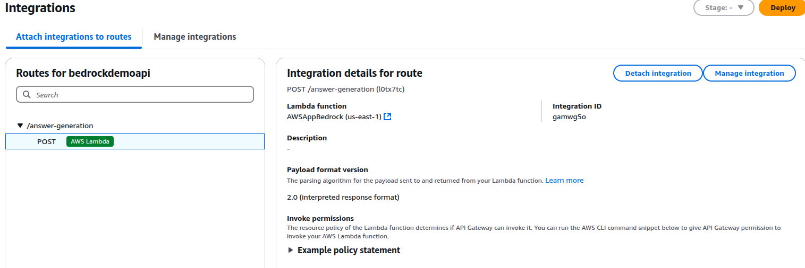
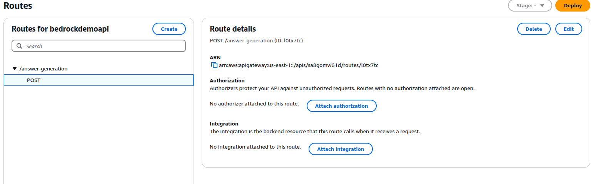
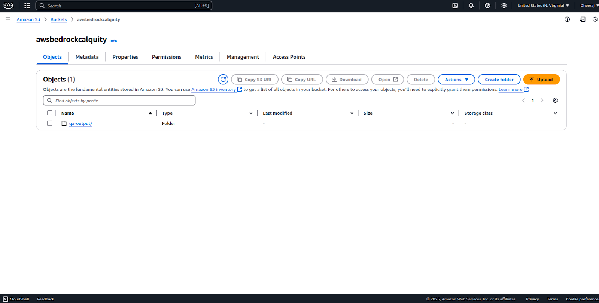
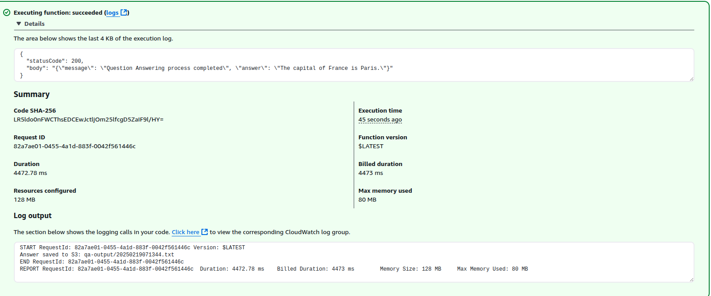

<<<<<<< HEAD
# Bedrock
=======
# Deploying Anthropic Claude on AWS Bedrock with Serverless Architecture  

## Overview  
This guide outlines the steps to deploy **Anthropic Claude-3** on **AWS Bedrock** using a fully serverless approach. The setup ensures that you are only charged based on usage and not for idle compute time.  

## Architecture  

- **Amazon Bedrock** : Fully managed, pay-per-use AI model deployment.  
- **AWS Lambda** : Executes inference requests on demand.  
- **Amazon API Gateway** : Provides a RESTful API interface to invoke Lambda.  
- **Amazon S3** : Stores generated answers from the model.  

## Step 1: Enable Anthropic Claude-3 Model Access  

1. **Go to AWS Bedrock Console** → Navigate to **Model Access**.  
2. Locate **`anthropic.claude-3-haiku-20240307-v1:0`**.  
3. Enable access to this model for your AWS account.  

## Step 2: Create an AWS Lambda Function  

1. **Go to AWS Lambda Console** → Create a new function.  
2. **Function Name** : `AWSAppBedrock`  
3. **Runtime** : Python 3.  
4. Copy and paste the Lambda function code provided below.  
5. Open **AWS CloudShell** and create a Lambda layer for `boto3`:  

    ```sh
    mkdir ./bedrock-layer
    cd ./bedrock-layer
    pip3 install -t ./python/ boto3
    zip -r bedrock-layer.zip .
    aws lambda publish-layer-version --layer-name bedrock-layer --zip-file fileb://bedrock-layer.zip
    ```  

6. Attach the newly created Lambda layer to the function in the AWS Console.  

### Assign IAM Role to Lambda  
- The Lambda function must have permissions to invoke AWS Bedrock.  
- Attach the **BedrockFullAccess** policy to the Lambda execution role:  

    1. Go to **IAM Console** → Roles  
    2. Find and select your Lambda execution role  
    3. Attach either **AmazonBedrockFullAccess** or **AdministratorAccess** (if needed).  

## Step 3: Create an API Gateway  

1. **Go to API Gateway Console** → Create an **HTTP API**.  
2. Click **Create** and configure the API.  
3. **Attach Integration** → Select Lambda function (`AWSAppBedrock`).  
4. Deploy the API and note the **endpoint URL** for later use.  



## Step 4: Create an S3 Bucket  

1. **Go to Amazon S3 Console** → Create a new bucket.  
2. **Bucket Name** : `awsbedrockcalquity` (or choose a custom name, but update it in the Lambda function accordingly).  


## Step 5: Lambda Function Code  
_(Check app.py for Lambda Function, make necessary changes)_  

## Step 6: Testing the Setup  

### 1. Test the Lambda Function  

- Go to **AWS Lambda Console** → Select `AWSAppBedrock`  
- Click **Test** and provide a JSON input:  

    ```json
    { "body": "{\"question\": \"What does Amazon Bedrock do?\"}"}
    ```  

- Check the output.  


### 2. Test API Gateway  

- Use `curl` or **Postman** to make a request to the API Gateway endpoint:  

    ```sh
    curl -X POST "https://your-api-id.execute-api.us-east-1.amazonaws.com" \
    -H "Content-Type: application/json" \
    -d '{"question": "Explain quantum computing."}'
    ```  

### 3. Check S3 Bucket  

- Go to **Amazon S3 Console** → Open `awsbedrockcalquity`  
- Look for saved QA outputs under **qa-output/**.  

## Conclusion  

This setup ensures a **fully serverless, pay-per-use deployment** of **Anthropic Claude-3** on **AWS Bedrock**. The API Gateway, Lambda, and S3 integration allow for a scalable and cost-efficient solution.  

### For Further Improvements:  

- **Adding authentication** using **AWS Cognito** or **API Gateway IAM policies**.  
- **Implementing logging & monitoring** via **AWS CloudWatch**.  

Now your serverless AI-powered question-answering system is live!  
>>>>>>> 60f6c61 (Initial commit)
